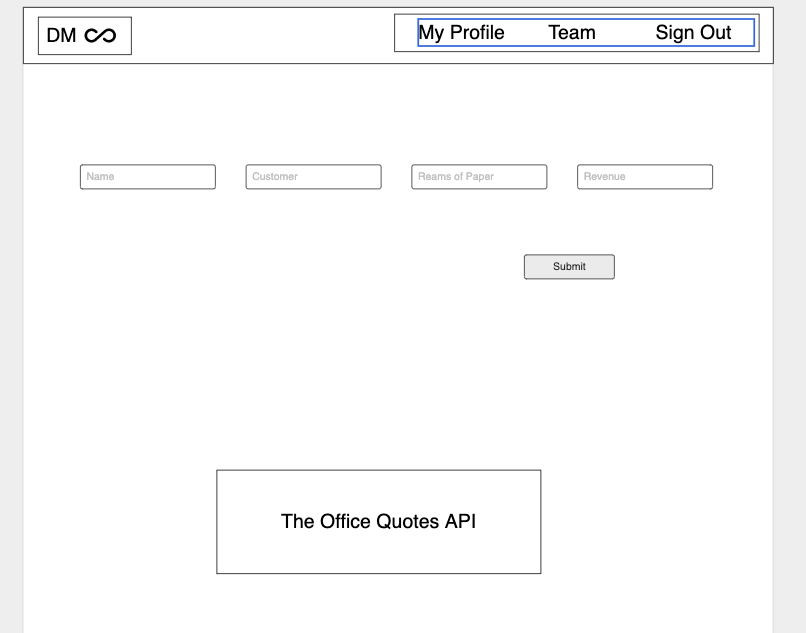

# Dunder Mifflinfinity

A company website that Dunder Mifflin employees can use to register sales made each day to help them manage their workflow.

## Index

- [Scope](#Scope)
- [User Stories](#user-stories)
- [Wireframes](#wireframes)
- [Data Models](#data-models)

## Scope

The final objective is to build an app where employees can login or register into the company website and register sales made each day. Users will be able to view their own sales and view profiles of employees from other branch locations

###### Technologies

- Mongo DB
- Express
- React
- Node

## User Stories

Dunder Mifflin employees can use this app to register sales made each day to help them manage their workflow.

Employees can
- Login if returning user
- If new user, employees can sign up to make an account
- Once logged in, employees can view home page
- Create, read, update, and/or delete their profile information
- Create and read sales that they have made
- Navigate to a different branch location to view other employee profiles of that specific branch
- See randomly generated quotes from the show “The Office”.

## Wireframes

### Login

Employees will login or create account

### Registration
New Employees will create an account in registration page

### Home Page
Once an employee is authenticated, they can now enter the company home page.

### Profile Page
This will show the employee's profile, including their sales

### Record a Sale
Employee can register a sale made. Will take in a customer name, amount of paper sold, and profit gained.

## Data Models

### Employee

- employeeId
- name
- email
- password
- department

### Sale
- employeedId
- customer 
- amountOfPaper
- profit